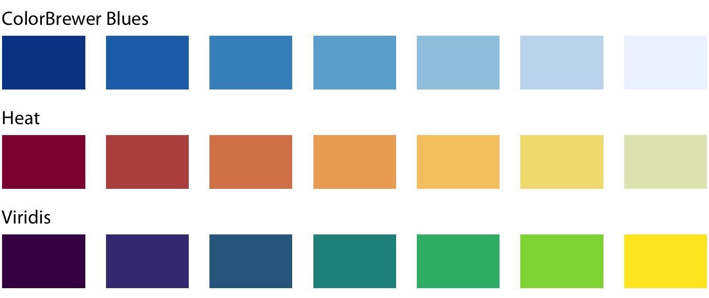
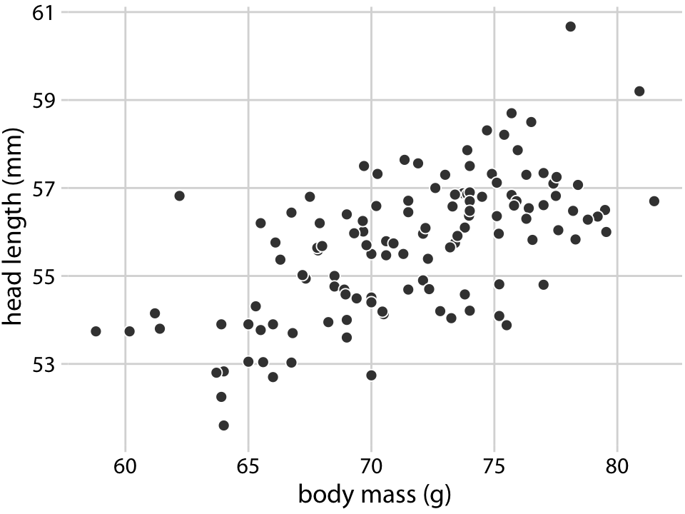
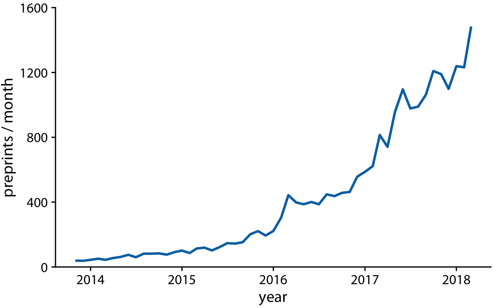

```{r setup, include=FALSE}
library(tidyverse)
library(knitr)
library(kableExtra)
library(dviz.supp)
knitr::opts_chunk$set(echo = FALSE, 
                      message = FALSE, 
                      warning = FALSE, 
                      fig.width = 8, 
                      fig.height = 6,
                      fig.align = "center",
                      collapse = TRUE)
```

## Gramática de gráficos

* Descripción precisa de todos los componentes necesarios para realizar una visualización 

  * Wilkinson, L. (2005), *The Grammar of Graphics*

* Una de las implementaciones más conocidas es la librería `ggplot2`:

    * Wickham, H. (2009), [*ggplot2: Elegant Graphics for Data Analysis*](https://ggplot2-book.org/)

* Artículo con las implicaciones de trasladar los conceptos de la gramática de gráficos a un lenguaje de programación (R):

    * Wickham, H. (2010), [*A Layered Grammar of Graphics*](https://vita.had.co.nz/papers/layered-grammar.pdf)


---

## Fundamentos de visualización de datos

* Wilke, C. O., (2019) [Fundamentals of data visualization](https://serialmentor.com/dataviz/)

* Guía moderna para realizar visualizaciones que:

  1. reflejan los datos de forma precisa
  
  2. cuentan una historia
  
  3. tienen una estética profesional
  
* Conceptos independientes de la herramienta que se usa!

* Los ejemplos del libro están hechos con `ggplot2` y otras librerías auxiliares

* Referencia principal de esta sesión (material en [Github](http://albertotb.com/curso-uam-dataviz/))

---

class: inverse, center, middle

# Visualización de datos

---

## Características estéticas

* Toda visualización es una correspondencia entre datos y características estéticas

* Ejemplo: un gráfico de dispersión representa la relación entre dos variables, **x** e **y**, mediante puntos

* Dos tipos:

  1. pueden representar datos continuos
  
  2. **no** pueden representar datos continuos
  
---

## Ejemplos

¿Cuáles de los siguientes elementos **no** pueden representar datos continuos?
![:vspace 4]

.center[

]

---

## Tipos de datos

* Independientes del lenguaje de programación/herramienta!

  1. **Numéricos continuos**: números decimales
  
  2. **Numéricos discretos**: por ej. números enteros
  
  3. **Categóricos**: con o sin orden, por ej. las CC.AA de España
  
  4. **Fechas/horas**: pueden ser continuos o discretos dependiendo de lo que representen
  
  5. **Texto**


---

## Ejemplo

¿Qué tipos de datos hay en la siguiente tabla?

```{r echo=FALSE}
df <- read_csv("ultimosdatos_3126Y_datos-horarios.csv", 
               locale = locale(encoding = "ISO-8859-1"), 
               skip = 3)
```

```{r echo=FALSE}
df %>% 
  select(`Fecha y hora oficial`, `Temperatura (ºC)`, `Velocidad del viento (km/h)`, `Dirección del viento`) %>%
  rename(`Viento (km/h)` = `Velocidad del viento (km/h)`,
         `Fecha y hora` = `Fecha y hora oficial`) %>%
  mutate(Estacion = "El Goloso") %>%
  drop_na()%>% 
  head(11) %>%
  arrange(`Fecha y hora`) %>%
  kable()
``` 

.center[
Fuente: [AEMET](http://www.aemet.es/es/eltiempo/observacion/ultimosdatos)
]

---

## Escalas

* Definen la equivalencia entre valores y elementos del gráfico

* Correspondencia 1 a 1 para evitar gráficos ambiguos

![:vspace 3]

.center[

]

---

## Ejemplo gráfico de líneas

.center[

]
---

## Ejemplo *heatmap*

![:vspace 8]

.center[

]

---

## Múltiples escalas

¿Cuántas escalas tiene el siguiente gráfico?

.center[

]

---

class: inverse, center, middle

# Sistemas de coordenadas y ejes

---

## Sistemas de coordenadas

* Necesarios para cualquier tipo de visualización

* Determinan donde se van a posicionar los distintos valores

* Para gráficos estándar en 2D, necesitamos 2 valores para identificar una posición

* Además también necesitamos especificar la distribución relativa

* **Sistema de coordenadas**: combinación de escalas de posición y su distribución relativa

---

## Coordenadas cartesianas

* Sistema de coordenadas más habitual

* Dos ejes ortogonales con escalas continuas, **x** e **y**

* Invariantes frente a transformaciones lineales

.center[

]

---

## Ejemplo

.center[

]

---

## Ejes lineales vs no lineales

* **Eje lineal**: la separación entre dos líneas de la rejilla es la misma en la visualización que en las unidades de los datos

* **Eje no lineal**: la distancia entre dos líneas de la rejilla no es proporcional a la separación en las unidades de los datos

![:vspace 0.5]

.center[

]

---

## Escala logaritmica

* Escala no lineal más común

* Multiplicar en la escala logarítmica es como sumar en la escala lineal

* Conveniente para datos que provienen de multiplicaciones/divisiones, por ej. ratios

```{r echo=FALSE}
df <- data.frame(poblacion = c(50, 100, 200), 
                 media = c(100, 100, 100),
                 ratio = c(0.5, 1, 2))

kable(df)
```

![:vspace 3]

```{r echo=FALSE, fig.width = 6, fig.asp = 1.7/4, fig.align='center'}
xaxis_lin <- ggplot(df, aes(ratio, y = 1)) + 
  geom_point(size = 3, color = "#0072B2") + 
  scale_y_continuous(limits = c(0.9, 1.1), expand = c(0, 0), breaks = 1) +
  theme_dviz_grid(14, rel_large = 1) +
  theme(axis.ticks.length = grid::unit(0, "pt"),
        axis.text.y = element_blank(),
        axis.title.y = element_blank(),
        axis.ticks.y = element_blank(),
        plot.title = element_text(face = "plain"),
        plot.margin = margin(3, 14, 3, 1.5))

plotlist <- 
  align_plots(xaxis_lin + scale_x_continuous(limits = c(0, 2)) + 
                ggtitle("datos originales, escala lineal"),
              xaxis_lin + scale_x_log10(limits = c(0.5, 2), breaks = c(0.5, 1, 2),
                                        labels = c("0.5", "1", "2")) + 
                ggtitle("datos originales, escala logarítmica (base 10)"))
plot_grid(plotlist[[1]], plotlist[[2]], ncol = 1)
```

---

## Ejemplo


---

## Otras escalas

* Escala logarítmica es también útil cuando hay datos con magnitudes muy diferentes
  * Representar en una misma escala una ciudad con población 100 y otra con población 1M
  
* Problema: no puede haber 0 en la escala logarítimica (`log(0) = -inf`)

* En algunos casos pueden ser útiles otras transformaciones, por ej. la raíz cuadrada

---

## Ejemplo

![:vspace 7]

.center[

]

---

## Sistemas de coordenadas  curvos

* Las coordenadas polares son el ejemplo más común

* Especificamos una posición usando un ángulo y una distancia radial al origen

* Útiles para datos con periodicidad intrínseca

![:vspace 2]

.center[

]

---

## Ejemplo

.center[

]

---

## Datos geográficos


---

## Otro ejemplo

.center[


Fuente: [ggradar](https://www.ggplot2-exts.org/ggradar.html)
]


---

## Otro (mal) ejemplo

.center[


Fuente: [Radar Plots usando ggplot2](https://rpubs.com/htejero/212368)
]

---

class: inverse, middle, center

# Escalas de color

---

## Escalas de color cualitativas

* En variables categóricas, usamos el color para distinguir grupos que no tienen ningún orden

* Características deseables:

  1. claramente **distinguibles** unos de otros
  
  2. **equivalentes**  
     * ningún color puede destacar sobre el resto
  
  3. distinguibles incluso para personas **daltónicas**

---

## Ejemplos

* Se pueden crear escalas personalizadas en la web [ColorBrewer 2.0](http://colorbrewer2.org/)

* También hay muchas disponibles:
    
  

* A no ser que exista alguna razón de peso (por ej. colores corporativos), siempre es recomendable usar una de las múltiples escalas por defecto

* Muchas fueron creadas para cumplir las propiedades anteriores:
  
  * .footnotesize[Okabe, M., and K. Ito. (2008), [Color Universal Design (CUD): How to Make Figures and Presentations That Are Friendly to Colorblind People.](https://jfly.uni-koeln.de/color/)]


---

## Escalas de color secuenciales

* Con variables continuas, usamos escalas de color secuenciales

* Revelan patrones en nuestros datos que sería muy complicado ver de otra forma

* Simplifican a nuestro cerebro la tarea de procesar...
  
  * ...que valores son más pequeños que otros
  * ...distancia entre valores
  
* Características deseables [[A better default colormap for matplotlib](https://www.youtube.com/watch?v=xAoljeRJ3lU)]:

  1. colorida
  2. agradable
  3. **secuencial**
  4. **perceptualmente uniforme**
  5. distinguible en **blanco y negro**
  6. accesible para personas **daltónicas**

* Una escala de color muy usada es [viridis](https://cran.r-project.org/web/packages/viridis/vignettes/intro-to-viridis.html)
---

## viridis


.center[Fuente: [mpl colormaps](https://bids.github.io/colormap/)]

---

## Secuenciales vs divergentes

.center[

]

--

![:vspace 0.5]

.center[

]

---

## Ejemplo secuencial

.center[

]

---

## Ejemplo divergente

.center[

]

---

## Destacar elementos usando color

* Las escalas de color qualitativas se pueden modificar para resaltar ciertos grupos:

  * creando versiones más oscuras y/o saturadas de algunos colores
  
  * combinando una escala de grises + color

* Importante que ninguno de los colores no-resaltados destaque sobre el resto!

.center[

]

* Otra opción es eliminar todo el color excepto el de los datos a resaltar

---

## Ejemplo resaltado

.center[

]

---

class: inverse, middle, center

# Cantidades

---

## Cantidades

* Valores numéricos para un conjunto de categorías

* Énfasis: magnitud de los valores

* Tipos de gráfico:

  1. gráfico de barras (*barplot*)
  
  2. gráfico de puntos (*dotplot*)
  
  3. mapas de calor (*heatmap*)
  
---

## Gráfico de barras

```{r echo=FALSE}
pew <-
  relig_income %>%
    pivot_longer(-religion, names_to = 'income', values_to = 'n_per')
```

```{r}
# Repetir el gráfico para las 5 anteriores
plot_pew <-
  pew %>%
    mutate(religion = fct_lump(religion, n = 6, w = n_per)) %>%
    ggplot(aes(x = religion, y = n_per)) +
    geom_col() + 
    labs(y = "Número de personas", x = "Religión")

plot_pew + theme_dviz_grid()
```

---

## Etiquetas rotadas

```{r}
plot_pew + theme_dviz_grid() + theme(axis.text.x = element_text(angle = 45, hjust = 1))
```

---

## Intercambiar ejes

```{r}
plot_pew + coord_flip() + theme_dviz_grid()
```

---

## Orden de las categorias

```{r}
pew %>%
  mutate(religion = fct_reorder(
    fct_lump(religion, n = 5, w = n_per), 
    n_per, .fun=sum)) %>%
  ggplot(aes(x = religion, y = n_per)) +
  geom_col() + 
  labs(y = "Número de personas", x = "Religión") + 
  coord_flip() + theme_dviz_grid()
```

---

## Variables cualitativas con orden

No usar orden alfabético ni orden creciente, sino el orden implícito de la variable

```{r}
pew %>%
  filter(income != "Don't know/refused") %>%
  ggplot(aes(x = income, y = n_per)) + geom_col() +
  labs(x = "Salario", y = "Número de personas") + theme_dviz_grid()
```

---

class: center, middle

```{r fig.width=10, fig.height=8}
pew %>%
  mutate(income = fct_reorder(income, n_per, .fun=sum)) %>%
  filter(income != "Don't know/refused") %>%
  ggplot(aes(x = income, y = n_per)) + geom_col() +
  labs(x = "Salario", y = "Número de personas") + theme_dviz_grid()
```

---

```{r fig.width=10, fig.height=8}
pew %>%
  mutate(income = fct_relevel(income, "<$10k"),
         income = fct_relevel(income, "$100-150k", after = 7)) %>%
  filter(income != "Don't know/refused") %>%
  ggplot(aes(x = income, y = n_per)) + geom_col() +
  labs(x = "Salario", y = "Número de personas") + theme_dviz_grid()
```

---

## Gráfico de barras agrupadas

```{r}
pew_tidy <-
pew %>%
  mutate(income = fct_relevel(income, "<$10k"),
         income = fct_relevel(income, "$100-150k", after = 7), 
         religion = fct_lump(religion, n = 5, w = n_per),
         religion = fct_reorder(religion, n_per, .fun=sum)) %>%
  filter(income != "Don't know/refused")
```

```{r fig.width=12}
pew_tidy %>%
  ggplot(aes(x = income, y = n_per, fill = religion)) + 
  geom_col(position = "dodge") + 
  scale_fill_OkabeIto() +
  labs(x = "Salario", y = "Número personas", fill = "Religión") + theme_dviz_grid()
```

---

class: center, middle

```{r fig.width=10, fig.height=8}
library(viridis)
pew_tidy %>%
  ggplot(aes(x = religion, y = n_per, fill = income)) + 
  geom_col(position = "dodge") + 
  scale_fill_viridis(discrete=TRUE) + 
  labs(x = "Religión", y = "Número personas", fill = "Salario") + theme_dviz_grid()
```

---

## Facetas

```{r}
pew_tidy %>%
  ggplot(aes(x = income, y = n_per)) + 
  geom_col(position = "dodge") + 
  labs(x = "Salario", y = "Número personas") + 
  facet_wrap(~religion) + coord_flip() + theme_dviz_grid()
```

---

## Barras apiladas

* Útiles cuando las cantidades que representan por las barras apiladas es significativa

* Por ejemplo, número de personas

.center[

]

---

## Gráfico de puntos

En ocasiones podemos sustituir las barras por un únic punto

```{r}
library(gapminder)
gapminder %>%
  filter(continent == "Europe", year == 2007) %>%
  ggplot(aes(x = lifeExp, y = fct_reorder(country, lifeExp))) + 
  geom_point() + 
  labs(x = "Esperanza de vida (años)", y = "País") + theme_dviz_grid()
```

---

Si lo representáramos con barras, como el eje tiene que empezar en 0, el gráfico quedaría muy cargado

```{r}
gapminder %>%
  filter(continent == "Europe", year == 2007) %>%
  ggplot(aes(x = fct_reorder(country, lifeExp), y = lifeExp)) + 
  geom_col() + 
  coord_flip() +
  labs(y = "Esperanza de vida (años)", x = "País") + theme_dviz_grid()
```

---

## Gráficos de barras: ejes

La cantidad de tinta debería de ser proporcional a la cantidad que se representa

.center[

]

---

En una escala lineal las barras siempre tienen que empezar en 0!!

.center[

]

---

## Mapas de calor (*heatmap*)

Enfatizan los patrones globales en lugar de los valores concretos

.center[

]

---

El orden es arbitrario

.center[

]

---

class: inverse, middle, center

## Distribuciones

---

## Histogramas

* Representan la distribución de una variable numérica continua (quantitativa)

```{r}
library(titanic)

age_counts <- hist(titanic$age, breaks = (0:15) * 5 + .01, plot = FALSE)$counts
age_hist <- data.frame(
  `age range` = c("0--5", "6--10", "11--15", "16--20", "21--25", "26--30", "31--35", "36--40", "41--45", "46--50", "51--55", "56--60", "61--65", "66--70", "71--75"),
  count = age_counts,
  check.names = FALSE
)
age_hist <- cbind(age_hist, age = (1:15) * 5 - 2.5)
```

```{r}
ggplot(age_hist, aes(x = age, y = count)) + 
  geom_col(width = 4.7, fill = "#56B4E9") + 
  scale_x_continuous(name = "Edad (años)", limits = c(0, 75)) + theme_dviz_grid()
```

---

## Elección número de intervalos

* Siempre hay que probar con distintos tamaños de intervalo!

.center[

]

---

## Gráficos de densidad

* Estiman la densidad (distribución) de la variable usando una técnica conocidad como *Kernel Density Estimation* (KDE)

* Cuidado con el rango del eje x!

```{r, fig.height=5}
library(ggridges)
ggplot(titanic, aes(x = age)) + 
  geom_density_line(fill = "#56B4E9", color = darken("#56B4E9", 0.5), bw = 2, kernel = "gaussian") + 
  scale_y_continuous(limits = c(0, 0.04), name = "Densidad") +
  scale_x_continuous(name = "Edad (años)", limits = c(0, 75)) + theme_dviz_grid()
```

---

## Ancho del kernel

* Igual que en los historgramas la elección del ancho del kernel influye en los resultados

.center[

]

.footnotesize[
a) kernel Gaussiano, ancho = 0.5
b) kernel Gaussiano, ancho = 2
c) kernel Gaussiano, ancho = 5
d) kernel rectangular, ancho = 2
]

---

## Dos distribuciones

Los histogramas tienen problemas a la hora de mostrar múltiples distribuciones

.center[

]

---

## Transparencias

.center[

]

---

## Gráficos de densidad solapados

.center[

]

---

## Gráficos de densidad: facetas

.center[

]

---

## Histograma doble rotado

.center[

]

---

# Más de dos distribuciones

Si queremos representar las de dos los gráficos de densidad suelen ser preferibles a los histogramas

.center[

]

---

class: inverse, middle, center

# Proporciones

---

## Gráficos circulares

.pull-left[
Ventajas:
 * Visualiza claramente las proporciones como parte de un conjunto
 * Visualiza fracciones como 1/2, 1/3,..

Desventajas:
 * Complicado comparar visualmente las proporciones relativas
]

.pull-right[

]

---

## Gráficos de barras apilados

* Otra alternativa a los gráficos circulares
* Fracciones como 1/2, 1/3, etc. no son evidente de forma visual

.center[

]

---

## Gráficos de barras

Permiten visualizar de forma sencilla las proporciones relativas

.center[

]

---

## Otro ejemplo

Gráfico circular

.center[

]

--

* No se pueden distinguir las diferencias entre grupos

* No se pueden distinguir las diferencias entre años

---

Gráfico de barras apiladas

.center[

]

--

Excepto para los grupos A y E, no podemos compararlos visualmente

---

Gráfico de barras

.center[

]

---

Al igual que en los gráficos de barras que representan cantidades, el eje y tiene que empezar siempre en 0

.center[


.footnotesize[Fuente: [A Quick Guide to Spotting Graphics That Lie](https://www.nationalgeographic.com/news/2015/06/150619-data-points-five-ways-to-lie-with-charts/)]
]

---

## Gráficos de barras apilados (dos categorías)

Si solo hay dos categorías, no tenemos problema con los valores intermedios

.center[

]

---

## Gráficos de densidad apilados

* Si la variable es continua, podemos usar en su lugar un gráfico de densidad apilado

* No tenemos renferencia de los valores absolutos!

.center[

]

---

class: inverse, middle, center

# Asociaciones de variables cuantitativas

---

## Gráfico de dispersión

Gráfico de puntos que representa 2 variables numéricas continuas

.center[

]

---

## Más de dos variables

Podemos representar una tercera variable (continua o discreta) usando el color con una escala apropiada

.center[

]

---

## Facetas

* Podemos usar también otros elementos estéticos del gráfico, como el tamaño de los puntos o su forma

* Si el gráfico está muy cargado, es conveniente separarlo en varios sub-gráficos (facetas)

.center[

]

---

## Gráfico de pares

Si tenemos más de dos variables cuantitativas, es común representar todos los pares posibles:

.center[

]

---

.center[


.footnotesize[Fuente: [seaborn.pairplot](https://seaborn.pydata.org/generated/seaborn.pairplot.html)]
]

---

## Correlogramas

* Para más de 3 o 4 variables, representar un gráfico de dispersión para cada uno de los pares posibles es complicado

* Una opción es resumir cada gráfico de dispersión calculando la correlación de las dos variables y representar ese valor

.center[

]

---

## Ejemplo

* Útil usar escala de color divergente

* Generalmente los límites son [-1, 1]

.center[

]

---

## Otro ejemplo

* Enfatizar correlaciones altas

.center[

]

---

## Reducción de dimensionalidad

.center[


.footnotesize[Fuente: [Teaching R how to see numbers](https://rpubs.com/linalu/digit_recognizer)]
]

---

class: inverse, middle, center

# Series temporales y tendencias

---

## Una serie temporal

Podemos utilizar puntos, pero la diferencia es que el eje x representa tiempo y por tanto están ordenados

.center[

]

---

A menudo se combinan con lineas para enfatizar la dependencia temporal

.center[

]

---

* Si los datos tienen una frecuencia temporal alta, podemos eliminar los puntos

* Importante tener en cuenta que las líneas representan datos inventados!

.center[

]

---

**Solo** si el eje y empieza en 0, podemos colorear el area bajo la curva

.center[

]

---

class: middle

.center[

]

---

class: middle

.center[

]

---

Hay que tener cuidado con las escalas!

.center[


.footnotesize[Fuente: [A Quick Guide to Spotting Graphics That Lie](https://www.nationalgeographic.com/news/2015/06/150619-data-points-five-ways-to-lie-with-charts/)]
]

---

## Multiples series temporales

.center[

]

---

class: middle

.center[

]

---

* Siempre que sea posible, es conveniente etiquetar directamente el gráfico

* Sobre todo si hay un número elevado de categorías (8+)

.center[

]

---

## Gráficos de líneas

Útiles siempre que el eje x tenga un orden implícito, aunque no represente tiempo

.center[

]

---

## Múltiples series temporales con distintas unidades

.center[

]

---

Nunca usar dos escalas distintas en el mismo gráfico!

.center[


.footnotesize[Fuente: [A Quick Guide to Spotting Graphics That Lie](https://www.nationalgeographic.com/news/2015/06/150619-data-points-five-ways-to-lie-with-charts/)]
]

---

## Tendencias

* Existen distintos métodos de suavizado para representar la tendencia

* Uno de los más populares es LOESS (*locally estimated scatterplot smoothing*)

.center[

]

---

También es útil usar estos métodos de suavizado en gráficos de dispersión

.center[

]

---

## Funciones de suavizado

Cuidado al interpretar los datos suavizados, pueden cambiar bastante dependiendo del método!

.center[

]

---

## Regresión lineal

Es muy común superponer la recta de regresión para comprobar visualmente si dos variables tienen relación lineal

.center[

]

---

## Ratio datos-tinta

* Concepto introducido por Edward Tufte en 1983

* Consiste en maximizar la proporción de los elementos estéticos del gráfico que se usan para visualizar datos

.center[
<iframe width="560" height="315" src="https://www.youtube.com/embed/bDbJBWvonVI" frameborder="0" allow="accelerometer; autoplay; encrypted-media; gyroscope; picture-in-picture" allowfullscreen></iframe>
]

---

.center[

]

