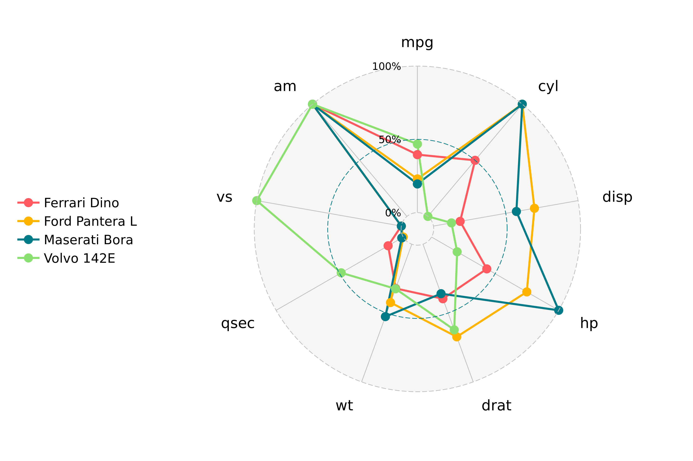
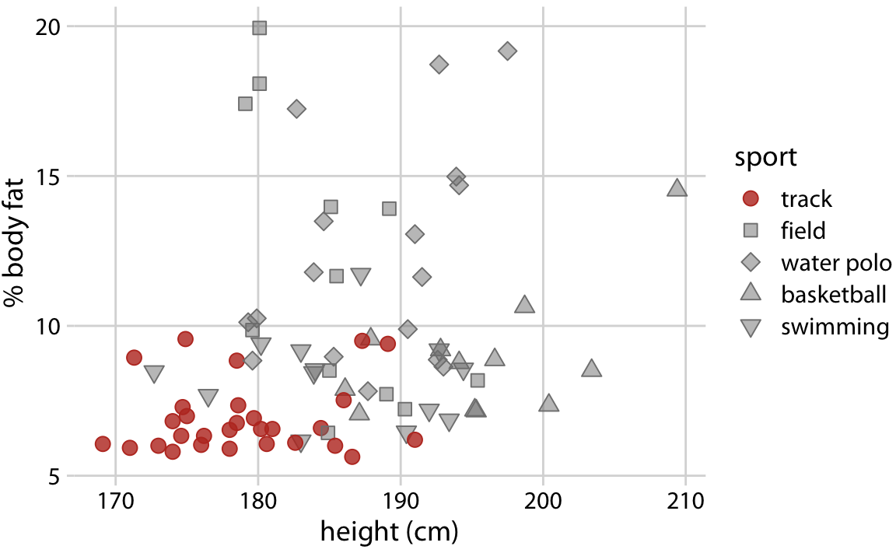
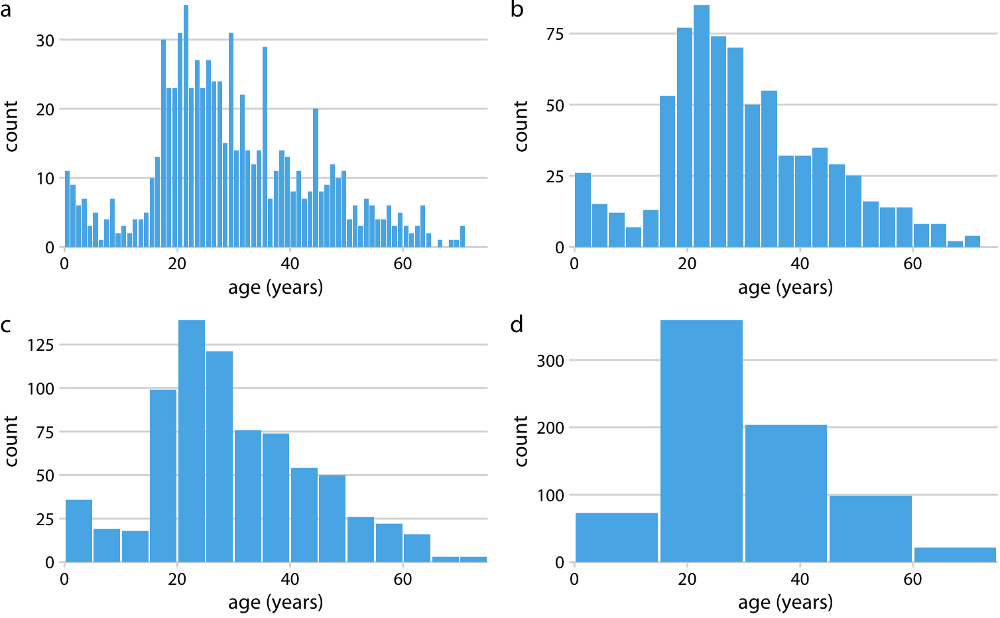
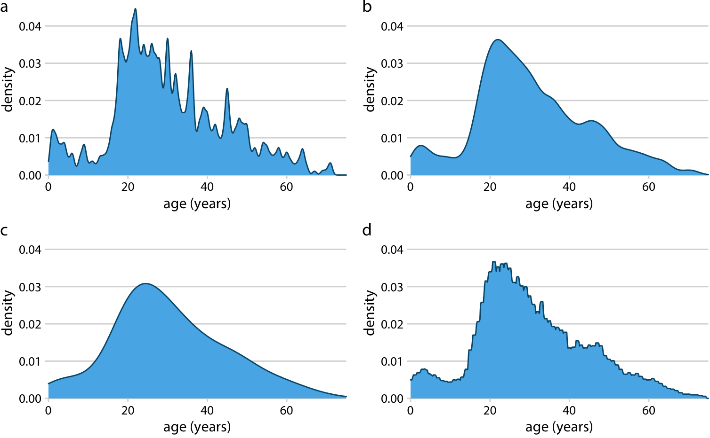
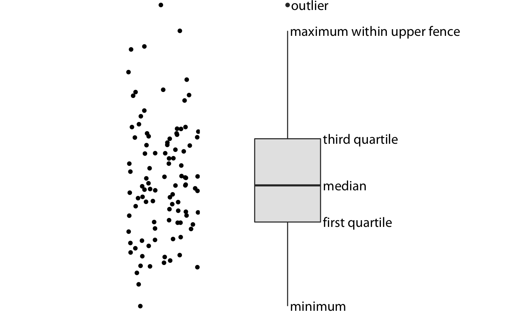
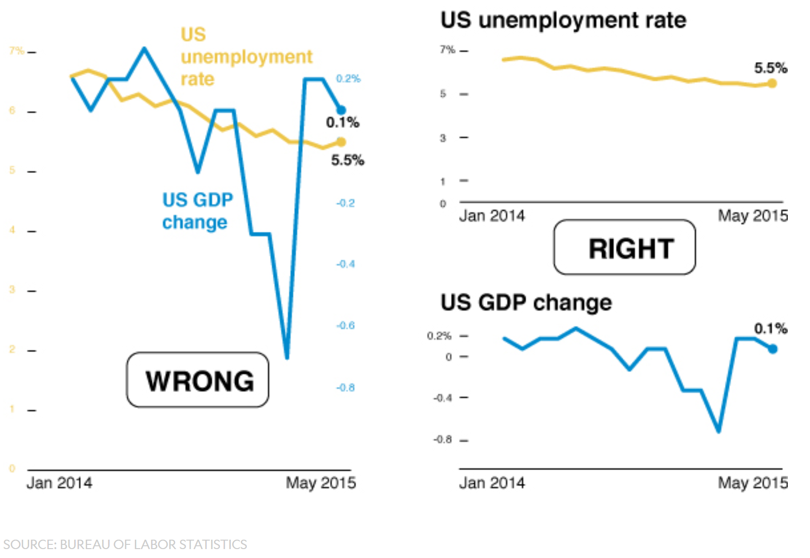

```{r setup, include=FALSE}
library(tidyverse)
library(knitr)
library(kableExtra)
#library(dviz.supp)
knitr::opts_chunk$set(echo = FALSE, 
                      message = FALSE, 
                      warning = FALSE, 
                      fig.width = 8, 
                      fig.height = 6,
                      fig.align = "center",
                      collapse = TRUE)
```


## Introducción

* Visualizar datos es mitad ciencia mitad arte

* Una buena visualización:

  1. representa los datos de forma correcta
  
  2. es estéticamente agradable, sin elementos que distraigan del mensaje principal que queremos transmitir
  
* Librerías de visualización principales en Python/R: matplotlib y ggplot2

* En esta sesión:

  1. como pasar de los datos al tipo de gráfico más adecuado

  2. directorio con los tipos de gráficos más comunes (no todos!)
  
  3. conceptos independientes de la herramienta concreta
  
  4. ejemplos en Python

---

## Gramática de gráficos

* Descripción precisa de todos los componentes necesarios para realizar una visualización 

  * Wilkinson, L. (2005), *The Grammar of Graphics*

* Una de las implementaciones más conocidas es la librería `ggplot2`:

    * Wickham, H. (2009), [*ggplot2: Elegant Graphics for Data Analysis*](https://ggplot2-book.org/)

* Artículo con las implicaciones de trasladar los conceptos de la gramática de gráficos a un lenguaje de programación (R):

    * Wickham, H. (2010), [*A Layered Grammar of Graphics*](https://vita.had.co.nz/papers/layered-grammar.pdf)


---

## Fundamentos de visualización de datos

* Wilke, C. O., (2019) [Fundamentals of data visualization](https://serialmentor.com/dataviz/)

* Guía moderna para realizar visualizaciones que:

  1. reflejan los datos de forma precisa
  
  2. cuentan una historia
  
  3. tienen una estética profesional
  
* Conceptos independientes de la herramienta que se usa!

* Los ejemplos del libro están hechos con `ggplot2` y otras librerías auxiliares

* Referencia principal de esta sesión (material en [Github](http://albertotb.com/curso-uam-dataviz/))

---

class: inverse, center, middle

# Introducción a la visualización

---

## Definición

Visualizar: representar mediante imágenes ópticas fenómenos de otro carácter

  - formar en la mente una imagen visual de un concepto abstracto
  
  - imaginar con rasgos visibles algo que no está a la vista
  
  - **hacer visible una imágen en un monitor**

---

## Objetivos

1. Representación de datos que soporte el análisis visual, exploración y descubrimiento

2. Transmitir información compleja de forma clara y eficaz, para comunicar los aspectos clave de forma intuitiva

3. Asimilación rápida de informacion

4. Hacer visibles patrones y fenómenos que no son accesibles de forma directa

---

## Importancia de la visualización

Cuarteto de Anscombe

.pull-left[

]


.pull-right[

]
---


Referencia: Anscombe, F. J. (1973). "Graphs in Statistical Analysis". American Statistician. 

---

class: center, middle


Referencia: [Justin Matejka, George Fitzmaurice. Same Stats, Different Graphs: Generating Datasets with Varied Appearance and Identical Statistics through Simulated Annealing](https://www.autodesk.com/research/publications/same-stats-different-graphs)

---

## Importancia de la visualización

- Comprensión: revelar patrones que no son evidentes a través del puro análisis numérico

- Hace uso de las capacidades del sistema visual y el cerebro

  - el cerebro es una máquina muy eficiente de detección de patrones y tendencias

- Comunicación

---

## Tipos de visualizaciones

- **Explorativas**: el objetivo es entender el contenido de un conjunto de datos no conocido, transformando los datos en características visuales para poder identificar sus características principales
  
  - muchos tipos de gráficos sencillos, para evitar perder información potencialmente relevante

- **Explicativas**: una vez que descubrimos el patrón en los datos en el que nos queremos centrar y vamos a crear un gráfico para explicárselo a otras personas

  - decidir que mantener y que eliminar para el objetivo concreto
  
  - optimizar el gráfico para ser enseñado, evitando distracciones


- Importante destacar que explicar algo con un gráfico no confirma necesariamente una [hipótesis](https://r4ds.had.co.nz/introduction.html#hypothesis-confirmation) (en general son necesarios modelos matemáticos para eso)


---

class: inverse, center, middle

# Visualización de datos

---

## Características estéticas

* Toda visualización es una correspondencia entre datos y características estéticas

* Ejemplo: un gráfico de dispersión representa la relación entre dos variables, **x** e **y**, mediante puntos

* Dos tipos:

  1. pueden representar datos continuos
  
  2. **no** pueden representar datos continuos
  
---

## Ejemplos

¿Cuáles de los siguientes elementos **no** pueden representar datos continuos?
![:vspace 4]

.center[

]

---

## Tipos de datos

* Independientes del lenguaje de programación/herramienta!

  1. **Numéricos continuos**: números decimales
  
  2. **Numéricos discretos**: por ej. números enteros
  
  3. **Categóricos**: con o sin orden, por ej. las CC.AA de España
  
  4. **Fechas/horas**: pueden ser continuos o discretos dependiendo de lo que representen
  
  5. **Texto**


---

## Ejemplo

¿Qué tipos de datos hay en la siguiente tabla?

```{r echo=FALSE}
df <- read_csv("ultimosdatos_3126Y_datos-horarios.csv", 
               locale = locale(encoding = "ISO-8859-1"), 
               skip = 3)
```

```{r echo=FALSE}
df %>% 
  select(`Fecha y hora oficial`, `Temperatura (ºC)`, `Velocidad del viento (km/h)`, `Dirección del viento`) %>%
  rename(`Viento (km/h)` = `Velocidad del viento (km/h)`,
         `Fecha y hora` = `Fecha y hora oficial`) %>%
  mutate(Estacion = "El Goloso") %>%
  drop_na()%>% 
  head(11) %>%
  arrange(`Fecha y hora`) %>%
  kable()
``` 

.center[
Fuente: [AEMET](http://www.aemet.es/es/eltiempo/observacion/ultimosdatos)
]

---

## Escalas

* Definen la equivalencia entre valores y elementos del gráfico

* Correspondencia 1 a 1 para evitar gráficos ambiguos

![:vspace 3]

.center[

]

---

## Ejemplo gráfico de líneas

.center[

]
---

## Ejemplo *heatmap*

![:vspace 8]

.center[

]

---

## Múltiples escalas

¿Cuántas escalas tiene el siguiente gráfico?

.center[

]

---

class: inverse, center, middle

# Sistemas de coordenadas y ejes

---

## Sistemas de coordenadas

* Necesarios para cualquier tipo de visualización

* Determinan donde se van a posicionar los distintos valores

* Para gráficos estándar en 2D, necesitamos 2 valores para identificar una posición

* Además también necesitamos especificar la distribución relativa

* **Sistema de coordenadas**: combinación de escalas de posición y su distribución relativa

---

## Coordenadas cartesianas

* Sistema de coordenadas más habitual

* Dos ejes ortogonales con escalas continuas, **x** e **y**

* Invariantes frente a transformaciones lineales

.center[

]

---

## Ejemplo

.center[

]

---

## Ejes lineales vs no lineales

* **Eje lineal**: la separación entre dos líneas de la rejilla es la misma en la visualización que en las unidades de los datos

* **Eje no lineal**: la distancia entre dos líneas de la rejilla no es proporcional a la separación en las unidades de los datos

![:vspace 0.5]

.center[

]

---

## Escala logaritmica

* Escala no lineal más común

* Multiplicar en la escala logarítmica es como sumar en la escala lineal

* Conveniente para datos que provienen de multiplicaciones/divisiones, por ej. ratios

```{r echo=FALSE}
df <- data.frame(poblacion = c(50, 100, 200), 
                 media = c(100, 100, 100),
                 ratio = c(0.5, 1, 2))

kable(df)
```

![:vspace 3]

```{r echo=FALSE, fig.width = 6, fig.asp = 1.7/4, fig.align='center'}
library(cowplot)
theme_dviz_grid <- function(font_size = 14, font_family = "", line_size = .5,
                            rel_small = 12/14, rel_tiny = 11/14, rel_large = 16/14,
                            colour = "grey90") {
  half_line <- font_size / 2
  
  cowplot::theme_minimal_grid(font_size = font_size, font_family = font_family, line_size = line_size,
                              rel_small = rel_small, rel_tiny = rel_tiny, rel_large = rel_large,
                              colour = colour)  %+replace%
    theme(
      plot.margin = margin(half_line/2, 1.5, half_line/2, 1.5),
      complete = TRUE
    )
}

plot_grid <- function(..., label_fontfamily = dviz_font_family,
                      label_fontface = "plain", hjust = 0, vjust = 1) {
  cowplot::plot_grid(..., label_fontfamily = label_fontfamily,
                     label_fontface = label_fontface,
                     hjust = hjust, vjust = vjust)
}

xaxis_lin <- ggplot(df, aes(ratio, y = 1)) + 
  geom_point(size = 3, color = "#0072B2") + 
  scale_y_continuous(limits = c(0.9, 1.1), expand = c(0, 0), breaks = 1) +
  theme_dviz_grid(14, rel_large = 1) +
  theme(axis.ticks.length = grid::unit(0, "pt"),
        axis.text.y = element_blank(),
        axis.title.y = element_blank(),
        axis.ticks.y = element_blank(),
        plot.title = element_text(face = "plain"),
        plot.margin = margin(3, 14, 3, 1.5))

plotlist <- 
  align_plots(xaxis_lin + scale_x_continuous(limits = c(0, 2)) + 
                ggtitle("datos originales, escala lineal"),
              xaxis_lin + scale_x_log10(limits = c(0.5, 2), breaks = c(0.5, 1, 2),
                                        labels = c("0.5", "1", "2")) + 
                ggtitle("datos originales, escala logarítmica (base 10)"))
plot_grid(plotlist[[1]], plotlist[[2]], ncol = 1)
```

---

## Ejemplo


---

## Otras escalas

* Escala logarítmica es también útil cuando hay datos con magnitudes muy diferentes
  * Representar en una misma escala una ciudad con población 100 y otra con población 1M
  
* Problema: no puede haber 0 en la escala logarítimica (`log(0) = -inf`)

* En algunos casos pueden ser útiles otras transformaciones, por ej. la raíz cuadrada

---

## Ejemplo

![:vspace 7]

.center[

]

---

## Sistemas de coordenadas  curvos

* Las coordenadas polares son el ejemplo más común

* Especificamos una posición usando un ángulo y una distancia radial al origen

* Útiles para datos con periodicidad intrínseca

![:vspace 2]

.center[

]

---

## Ejemplo

.center[

]

---

## Datos geográficos


---

## Otro ejemplo

.center[


Fuente: [ggradar](https://www.ggplot2-exts.org/ggradar.html)
]


---

## Otro (mal) ejemplo

.center[


Fuente: [Radar Plots usando ggplot2](https://rpubs.com/htejero/212368)
]

---

class: inverse, middle, center

# Escalas de color

---

## Escalas de color cualitativas

* En variables categóricas, usamos el color para distinguir grupos que no tienen ningún orden

* Características deseables:

  1. claramente **distinguibles** unos de otros
  
  2. **equivalentes**  
     * ningún color puede destacar sobre el resto
  
  3. distinguibles incluso para personas **daltónicas**

---

## Ejemplos

* Se pueden crear escalas personalizadas en la web [ColorBrewer 2.0](http://colorbrewer2.org/)

* También hay muchas disponibles:
    
  

* A no ser que exista alguna razón de peso (por ej. colores corporativos), siempre es recomendable usar una de las múltiples escalas por defecto

* Muchas fueron creadas para cumplir las propiedades anteriores:
  
  * .footnotesize[Okabe, M., and K. Ito. (2008), [Color Universal Design (CUD): How to Make Figures and Presentations That Are Friendly to Colorblind People.](https://jfly.uni-koeln.de/color/)]


---

## Escalas de color secuenciales

* Con variables continuas, usamos escalas de color secuenciales

* Revelan patrones en nuestros datos que sería muy complicado ver de otra forma

* Simplifican a nuestro cerebro la tarea de procesar...
  
  * ...que valores son más pequeños que otros
  * ...distancia entre valores
  
* Características deseables [[A better default colormap for matplotlib](https://www.youtube.com/watch?v=xAoljeRJ3lU)]:

  1. colorida
  2. agradable
  3. **secuencial**
  4. **perceptualmente uniforme**
  5. distinguible en **blanco y negro**
  6. accesible para personas **daltónicas**

* Una escala de color muy usada es [viridis](https://cran.r-project.org/web/packages/viridis/vignettes/intro-to-viridis.html)
---

## viridis


.center[Fuente: [mpl colormaps](https://bids.github.io/colormap/)]

---

## jet vs viridis

.pull-left[
.center[

]
]

--

.pull-right[
.center[

]
]

.center[.footnotesize[Fuente: [Hurricanes and Data Visualisation: Part I(b) – The Mona Lisa](https://peterjamesthomas.com/2017/09/15/hurricanes-and-data-visualisation-part-ib-the-mona-lisa/)]]

---

## Secuenciales vs divergentes

.center[

]

--

![:vspace 0.5]

.center[

]

---

## Ejemplo secuencial

.center[

]

---

## Ejemplo divergente

.center[

]

---

## Destacar elementos usando color

* Las escalas de color qualitativas se pueden modificar para resaltar ciertos grupos:

  * creando versiones más oscuras y/o saturadas de algunos colores
  
  * combinando una escala de grises + color

* Importante que ninguno de los colores no-resaltados destaque sobre el resto!

.center[

]

* Otra opción es eliminar todo el color excepto el de los datos a resaltar

---

## Ejemplo resaltado

.center[

]

---

class: inverse, middle, center

# Cantidades

---

## Cantidades

* Valores numéricos para un conjunto de categorías

* Énfasis: magnitud de los valores

* Tipos de gráfico:

  1. gráfico de barras (*barplot*)
  
  2. gráfico de puntos (*dotplot*)
  
  3. mapas de calor (*heatmap*)
  
---

## Gráfico de barras

```{r echo=FALSE}
pew <-
  relig_income %>%
    pivot_longer(-religion, names_to = 'income', values_to = 'n_per')
```

```{r}
# Repetir el gráfico para las 5 anteriores
plot_pew <-
  pew %>%
    mutate(religion = fct_lump(religion, n = 6, w = n_per)) %>%
    ggplot(aes(x = religion, y = n_per)) +
    geom_col() + 
    labs(y = "Número de personas", x = "Religión")

plot_pew + theme_dviz_grid()
```

---

## Etiquetas rotadas

```{r}
plot_pew + theme_dviz_grid() + theme(axis.text.x = element_text(angle = 45, hjust = 1))
```

---

## Intercambiar ejes

```{r}
plot_pew + coord_flip() + theme_dviz_grid()
```

---

## Orden de las categorias

```{r}
pew %>%
  mutate(religion = fct_reorder(
    fct_lump(religion, n = 5, w = n_per), 
    n_per, .fun=sum)) %>%
  ggplot(aes(x = religion, y = n_per)) +
  geom_col() + 
  labs(y = "Número de personas", x = "Religión") + 
  coord_flip() + theme_dviz_grid()
```

---

## Variables cualitativas con orden

No usar orden alfabético ni orden creciente, sino el orden implícito de la variable

```{r}
pew %>%
  filter(income != "Don't know/refused") %>%
  ggplot(aes(x = income, y = n_per)) + geom_col() +
  labs(x = "Salario", y = "Número de personas") + theme_dviz_grid()
```

---

class: center, middle

```{r fig.width=10, fig.height=8}
pew %>%
  mutate(income = fct_reorder(income, n_per, .fun=sum)) %>%
  filter(income != "Don't know/refused") %>%
  ggplot(aes(x = income, y = n_per)) + geom_col() +
  labs(x = "Salario", y = "Número de personas") + theme_dviz_grid()
```

---

```{r fig.width=10, fig.height=8}
pew %>%
  mutate(income = fct_relevel(income, "<$10k"),
         income = fct_relevel(income, "$100-150k", after = 7)) %>%
  filter(income != "Don't know/refused") %>%
  ggplot(aes(x = income, y = n_per)) + geom_col() +
  labs(x = "Salario", y = "Número de personas") + theme_dviz_grid()
```

---

## Gráfico de barras agrupadas

¿Cómo ordenar las barras?
```{r}
pew_tidy <-
pew %>%
  mutate(income = fct_relevel(income, "<$10k"),
         income = fct_relevel(income, "$100-150k", after = 7), 
         religion = fct_lump(religion, n = 5, w = n_per),
         religion = fct_reorder(religion, n_per, .fun=sum)) %>%
  filter(income != "Don't know/refused")
```

```{r fig.width=12}
palette_OkabeIto <- c("#E69F00", "#56B4E9", "#009E73", "#F0E442", "#0072B2", "#D55E00", "#CC79A7", "#999999")

#' @rdname palette_OkabeIto
#' @export
palette_OkabeIto_black <- c("#E69F00", "#56B4E9", "#009E73", "#F0E442", "#0072B2", "#D55E00", "#CC79A7", "#000000")

#' @rdname scale_OkabeIto
#' @export
#' @usage NULL
scale_colour_OkabeIto <- function(aesthetics = "colour", ...) {
  scale_OkabeIto(aesthetics, ...)
}

#' @rdname scale_OkabeIto
#' @export
#' @usage NULL
scale_color_OkabeIto <- scale_colour_OkabeIto

#' @rdname scale_OkabeIto
#' @export
#' @usage NULL
scale_fill_OkabeIto <- function(aesthetics = "fill", ...) {
  scale_OkabeIto(aesthetics, ...)
}

#' Okabe-Ito color scale
#'
#' This is a color-blind friendly, qualitative scale with eight different colors. See [palette_OkabeIto] for details.
#' @param use_black If `TRUE`, scale includes black, otherwise includes gray.
#' @param order Numeric vector listing the order in which the colors should be used. Default is 1:8.
#' @param darken Relative amount by which the scale should be darkened (for positive values) or lightened (for negatice
#'   values).
#' @param alpha Alpha transparency level of the color. Default is no transparency.
#' @param ... common discrete scale parameters: `name`, `breaks`, `labels`, `na.value`, `limits`, `guide`, and `aesthetics`.
#'  See [discrete_scale] for more details.
#' @examples
#' library(ggplot2)
#' ggplot(iris, aes(Sepal.Length, Sepal.Width, color = Species)) +
#'   geom_point() + scale_color_OkabeIto()
#' ggplot(iris, aes(Sepal.Length, fill = Species)) +
#'   geom_density(alpha = 0.7) + scale_fill_OkabeIto(order = c(1, 3, 5))
#'
#' cowplot::plot_grid(
#'   gg_color_swatches(8) + scale_fill_OkabeIto(darken = 0.6),
#'   gg_color_swatches(8) + scale_fill_OkabeIto(darken = 0.4),
#'   gg_color_swatches(8) + scale_fill_OkabeIto(darken = 0.2),
#'   gg_color_swatches(8) + scale_fill_OkabeIto(darken = 0),
#'   gg_color_swatches(8) + scale_fill_OkabeIto(darken = -0.2),
#'   gg_color_swatches(8) + scale_fill_OkabeIto(darken = -0.4),
#'   gg_color_swatches(8) + scale_fill_OkabeIto(darken = -0.6), ncol = 1)
#' @export
#' @usage NULL
scale_OkabeIto <- function(aesthetics, use_black = FALSE, order = 1:8, darken = 0, alpha = NA, ...) {
  if (use_black) {
    values <- palette_OkabeIto_black[order]
  }
  else {
    values <- palette_OkabeIto[order]
  }

  n <- length(values)
  darken <- rep_len(darken, n)
  alpha <- rep_len(alpha, n)

  di <- darken > 0
  if (sum(di) > 0) { # at least one color needs darkening
    values[di] <- colorspace::darken(values[di], amount = darken[di])
  }

  li <- darken < 0
  if (sum(li) > 0) { # at least one color needs lightening
    values[li] <- colorspace::lighten(values[li], amount = -1*darken[li])
  }

  ai <- !is.na(alpha)
  if (sum(ai) > 0) { # at least one color needs alpha
    values[ai] <- scales::alpha(values[ai], alpha[ai])
  }

  pal <- function(n) {
    if (n > length(values)) {
      warning("Insufficient values in manual scale. ", n, " needed but only ",
           length(values), " provided.", call. = FALSE)
    }
    values
  }
  ggplot2::discrete_scale(aesthetics, "manual", pal, ...)
}

pew_tidy %>%
  ggplot(aes(x = income, y = n_per, fill = religion)) + 
  geom_col(position = "dodge") + 
  scale_fill_OkabeIto() +
  labs(x = "Salario", y = "Número personas", fill = "Religión") + theme_dviz_grid()
```

---

class: center, middle

```{r fig.width=10, fig.height=8}
library(viridis)

pew_tidy %>%
  ggplot(aes(x = religion, y = n_per, fill = income)) + 
  geom_col(position = "dodge") + 
  scale_fill_viridis(discrete=TRUE) + 
  labs(x = "Religión", y = "Número personas", fill = "Salario") + theme_dviz_grid()
```

---

## Facetas

```{r}
pew_tidy %>%
  ggplot(aes(x = income, y = n_per)) + 
  geom_col(position = "dodge") + 
  labs(x = "Salario", y = "Número personas") + 
  facet_wrap(~religion) + coord_flip() + theme_dviz_grid()
```

---

## Barras apiladas

* Útiles cuando las cantidades que representan por las barras apiladas es significativa

* Por ejemplo, número de personas

.center[

]

---

## Gráfico de puntos

En ocasiones podemos sustituir las barras por un únic punto

```{r}
library(gapminder)
gapminder %>%
  filter(continent == "Europe", year == 2007) %>%
  ggplot(aes(x = lifeExp, y = fct_reorder(country, lifeExp))) + 
  geom_point() + 
  labs(x = "Esperanza de vida (años)", y = "País") + theme_dviz_grid()
```

---

Si lo representáramos con barras, como el eje tiene que empezar en 0, el gráfico quedaría muy cargado

```{r}
gapminder %>%
  filter(continent == "Europe", year == 2007) %>%
  ggplot(aes(x = fct_reorder(country, lifeExp), y = lifeExp)) + 
  geom_col() + 
  coord_flip() +
  labs(y = "Esperanza de vida (años)", x = "País") + theme_dviz_grid()
```

---

## Gráficos de barras: ejes

La cantidad de tinta debería de ser proporcional a la cantidad que se representa

.center[

]

---

En una escala lineal las barras siempre tienen que empezar en 0!!

.center[

]

---

## Mapas de calor (*heatmap*)

Enfatizan los patrones globales en lugar de los valores concretos

.center[

]

---

El orden es arbitrario

.center[

]

---

class: inverse, middle, center

## Distribuciones

---

## Histogramas

* Representan la distribución de una variable numérica continua (quantitativa)

```{r}
library(titanic)
library(tidyr)

age_counts <- hist(drop_na(titanic_train)$Age, breaks = (0:16) * 5 + .01, plot = FALSE)$counts
age_hist <- data.frame(
  `age range` = c("0--5", "6--10", "11--15", "16--20", "21--25", "26--30", "31--35", "36--40", "41--45", "46--50", "51--55", "56--60", "61--65", "66--70", "71--75", "76--80"),
  count = age_counts,
  check.names = FALSE
)
age_hist <- cbind(age_hist, age = (1:16) * 5 - 2.5)
```

```{r}
ggplot(age_hist, aes(x = age, y = count)) + 
  geom_col(width = 4.7, fill = "#56B4E9") + 
  scale_x_continuous(name = "Edad (años)", limits = c(0, 75)) + theme_dviz_grid()
```

---

## Elección número de intervalos

* Siempre hay que probar con distintos tamaños de intervalo!

.center[

]

---

## Gráficos de densidad

* Estiman la densidad (distribución) de la variable usando una técnica conocidad como *Kernel Density Estimation* (KDE)

* Cuidado con el rango del eje x!

```{r, fig.height=5}
library(ggridges)
library(tinter)
ggplot(titanic_train, aes(x = Age)) + 
  geom_density_line(fill = "#56B4E9", color = darken("#56B4E9", 0.5), bw = 2, kernel = "gaussian") + 
  scale_y_continuous(limits = c(0, 0.04), name = "Densidad") +
  scale_x_continuous(name = "Edad (años)", limits = c(0, 75)) + theme_dviz_grid()
```

---

## Ancho del kernel

* Igual que en los historgramas la elección del ancho del kernel influye en los resultados

.center[

]

.footnotesize[
a) kernel Gaussiano, ancho = 0.5
b) kernel Gaussiano, ancho = 2
c) kernel Gaussiano, ancho = 5
d) kernel rectangular, ancho = 2
]

---

## Dos distribuciones

Los histogramas tienen problemas a la hora de mostrar múltiples distribuciones

.center[

]

---

## Transparencias

.center[

]

---

## Gráficos de densidad solapados

.center[

]

---

## Gráficos de densidad: facetas

.center[

]

---

## Histograma doble rotado

.center[

]

---

# Más de dos distribuciones

Si queremos representar las de dos los gráficos de densidad suelen ser preferibles a los histogramas

.center[

]

---

## Gráfico de cajas

Represente los principales estadísticos de una variable continua

.center[

]

---

class: center, middle


---

.center[

]

--

Generalmente las barras verticales se usan para representar errores, no variabilidad en los datos (distribución)

---

## Gráficos "violín"

* Alternativa a los gráficos de cajas si hay un número de puntos suficientemente alto

* Se estima la densidad usando KDE, se rota 90 grados y se replica


---

Las desventajas son las mismas que los gráficos de densidad:
  
  * Pueden representar datos en zonas donde no los hay
  
  * Perdemos la noción de la cantidad de puntos

.center[

]

---

class: middle

.center[


.footnotesize[Fuente: [Seaborn Library for Data Visualization in Python: Part 1](https://stackabuse.com/seaborn-library-for-data-visualization-in-python-part-1/)]
]

---

## *Strip chart*

Si no hay muchos puntos, podemos representarlos directamente


---

## Ruido aleatorio

Generalmente es útil añadir un pequeño ruido aleatorio para que no se superpongan los puntos


---

class: middle

.center[


.footnotesize[Fuente: [Seaborn Library for Data Visualization in Python: Part 1](https://stackabuse.com/seaborn-library-for-data-visualization-in-python-part-1/)]
]

---

## *Ridgeline plot*

* Distribución de una variable continua para distintos grupos

* Similar al gráfico "violín", pero rotado


---

class: inverse, middle, center

# Proporciones

---

## Gráficos circulares

.pull-left[
Ventajas:
 * Visualiza claramente las proporciones como parte de un conjunto
 * Visualiza fracciones como 1/2, 1/3,..

Desventajas:
 * Complicado comparar visualmente las proporciones relativas
]

.pull-right[

]

---

## Gráficos de barras apilados

* Otra alternativa a los gráficos circulares
* Fracciones como 1/2, 1/3, etc. no son evidente de forma visual

.center[

]

---

## Gráficos de barras

Permiten visualizar de forma sencilla las proporciones relativas

.center[

]

---

## Otro ejemplo

Gráfico circular

.center[

]

--

* No se pueden distinguir las diferencias entre grupos

* No se pueden distinguir las diferencias entre años

---

Gráfico de barras apiladas

.center[

]

--

Excepto para los grupos A y E, no podemos compararlos visualmente

---

Gráfico de barras

.center[

]

---

Al igual que en los gráficos de barras que representan cantidades, el eje y tiene que empezar siempre en 0

.center[


.footnotesize[Fuente: [A Quick Guide to Spotting Graphics That Lie](https://www.nationalgeographic.com/news/2015/06/150619-data-points-five-ways-to-lie-with-charts/)]
]

---

## Gráficos de barras apilados (dos categorías)

Si solo hay dos categorías, no tenemos problema con los valores intermedios

.center[

]

---

## Gráficos de densidad apilados

* Si la variable es continua, podemos usar en su lugar un gráfico de densidad apilado

* No tenemos renferencia de los valores absolutos!

.center[

]

---

class: inverse, middle, center

# Asociaciones de variables cuantitativas

---

## Gráfico de dispersión

Gráfico de puntos que representa 2 variables numéricas continuas

.center[

]

---

## Más de dos variables

Podemos representar una tercera variable (continua o discreta) usando el color con una escala apropiada

.center[

]

---

## Facetas

* Podemos usar también otros elementos estéticos del gráfico, como el tamaño de los puntos o su forma

* Si el gráfico está muy cargado, es conveniente separarlo en varios sub-gráficos (facetas)

.center[

]

---

## Gráfico de pares

Si tenemos más de dos variables cuantitativas, es común representar todos los pares posibles:

.center[

]

---

.center[


.footnotesize[Fuente: [seaborn.pairplot](https://seaborn.pydata.org/generated/seaborn.pairplot.html)]
]

---

## Correlogramas

* Para más de 3 o 4 variables, representar un gráfico de dispersión para cada uno de los pares posibles es complicado

* Una opción es resumir cada gráfico de dispersión calculando la correlación de las dos variables y representar ese valor

.center[

]

---

## Ejemplo

* Útil usar escala de color divergente

* Generalmente los límites son [-1, 1]

.center[

]

---

## Otro ejemplo

* Enfatizar correlaciones altas

.center[

]

---

## Reducción de dimensionalidad

.center[


.footnotesize[Fuente: [Teaching R how to see numbers](https://rpubs.com/linalu/digit_recognizer)]
]

---

class: inverse, middle, center

# Series temporales y tendencias

---

## Una serie temporal

Podemos utilizar puntos, pero la diferencia es que el eje x representa tiempo y por tanto están ordenados

.center[

]

---

A menudo se combinan con lineas para enfatizar la dependencia temporal

.center[

]

---

* Si los datos tienen una frecuencia temporal alta, podemos eliminar los puntos

* Importante tener en cuenta que las líneas representan datos inventados!

.center[

]

---

**Solo** si el eje y empieza en 0, podemos colorear el area bajo la curva

.center[

]

---

class: middle

.center[

]

---

class: middle

.center[

]

---

Hay que tener cuidado con las escalas!

.center[


.footnotesize[Fuente: [A Quick Guide to Spotting Graphics That Lie](https://www.nationalgeographic.com/news/2015/06/150619-data-points-five-ways-to-lie-with-charts/)]
]

---

## Multiples series temporales

.center[

]

---

class: middle

.center[

]

---

* Siempre que sea posible, es conveniente etiquetar directamente el gráfico

* Sobre todo si hay un número elevado de categorías (8+)

.center[

]

---

## Gráficos de líneas

Útiles siempre que el eje x tenga un orden implícito, aunque no represente tiempo

.center[

]

---

## Múltiples series temporales con distintas unidades

.center[

]

---

Nunca usar dos escalas distintas en el mismo gráfico!

.center[


.footnotesize[Fuente: [A Quick Guide to Spotting Graphics That Lie](https://www.nationalgeographic.com/news/2015/06/150619-data-points-five-ways-to-lie-with-charts/)]
]

---

## Tendencias

* Existen distintos métodos de suavizado para representar la tendencia

* Uno de los más populares es LOESS (*locally estimated scatterplot smoothing*)

.center[

]

---

También es útil usar estos métodos de suavizado en gráficos de dispersión

.center[

]

---

## Funciones de suavizado

Cuidado al interpretar los datos suavizados, pueden cambiar bastante dependiendo del método!

.center[

]

---

## Regresión lineal

Es muy común superponer la recta de regresión para comprobar visualmente si dos variables tienen relación lineal

.center[

]

---

class: middle, inverse, center

# Otros tipos de gráficos

---

## Más gráficos

* Hemos visto los más comunes, pero hay muchos más:
  
   * Datos geoespaciales

   * Gráficos cuantil-cuantil

   * Gráficos mosaico

   * Mapas en árbol

   * Conjuntos paralelos

   * etc.

* Un buen directorio: [From Data to Viz](https://www.data-to-viz.com/)

---

class: middle, inverse, center

# Conceptos de diseño de visualizaciones

---

## Ratio datos-tinta

* Concepto introducido por Edward Tufte en 1983

* Sin importar el tipo de gráfico, tiene que ser estéticamente agradable para no distraer del mensaje a transmitir

* Consiste en maximizar la proporción de los elementos estéticos del gráfico que se usan para visualizar datos

.center[
<iframe width="560" height="315" src="https://www.youtube.com/embed/bDbJBWvonVI" frameborder="0" allow="accelerometer; autoplay; encrypted-media; gyroscope; picture-in-picture" allowfullscreen></iframe>
]

---
.center[

]

---

## Principio de "proportional ink"

.content-box-green[
El tamaño de las areas coloreadas en una visualización tiene que ser proporcional a los valores que representan
]

- En escalas lineales, los gráficos de barras siempre deben de empezar en 0

- Hemos visto varios ejemplos, pero no solo ocurre con los gráficos de barras

---

.center[]

Fuente: Alberto Cairo. Graphics Lies, Misleading Visuals

---

## Elecciones de EEUU: cloropleth


---

## Elecciones de EEUU: cartograma


Fuente: [What’s Going On in This Graph? | 2020 Presidential Election Maps](https://www.nytimes.com/2020/11/19/learning/whats-going-on-in-this-graph-2020-presidential-election-maps.html)

---

## Elecciones de EEUU: mapa de densidad (burbujas)


---

## Elecciones de EEUU: mapa dasimétrico


Fuente: Wired. [Is the US Leaning Red or Blue? It All Depends on Your Map](https://www.wired.com/story/is-us-leaning-red-or-blue-election-maps/)

---

## Visualizaciones en datasets muy grandes

- Los gráficos de dispersión no funcionan excesivamente bien porque los puntos se solapan

- El mismo problema puede ocurrir en datasets pequeños donde los datos tienen poca precisión o están redondeados

---

Ejemplo: hay 21 vehículos con un valor de *displacement* igual a 2, pero solo tienen 4 valores de *mpg* distintos (19, 20, 21, 22)

.center[

]

---

Para aliviar el problema, se pueden usar transparencias

.center[

]

---

## Ruido aleatorio

- Otra opción es añadir un pequeño ruido aleatorio

.center[]

---

- Hay que tener cuidado con la cantidad de ruido, ya que estamos "falseando" los datos

.center[]

---


---

## Histogramas en 2D

- Cuando hay demasiados puntos las transparencias (con o sin ruido) no son suficientes para solucionar el problema de solapamiento


---

En esos casos, podemos hacer un histograma en 2D


---

- También se pueden usar hexágonos en lugar de rectángulos

 

---

## Curvas de nivel

Otra alternativa es estimar la densidad de los puntos en 2D e unir regiones con diferente densidad usando curvas de nivel


---

.pull-left[

]

.pull-right[

]

Los colores oscuros representan areas de mayor densidad

---

## Contar una historia

- Principal objetivo de las visualizaciones: comunicación

- Para transmitir la información extraida de los datos de forma efectiva, tenemos que contarla de forma **clara** e **interesante**

- No se trata de inventar datos, las visualizaciones tienen que respetar todas las normas vistas anteriormente

   - A menudo hay varias formas de representar los mismos datos

- Objetivo: usar hecho y razonamientos lógicos para que la audiencia se interese por la información que se está transmitiendo

---

## ¿Qué es una historia?

- Conjunto de observaciones, hechos o eventos (ciertos o inventados) que se presentan en un orden específico para crear una reacción emocional en la audiencia

- Existen múltiples estructuras para contar historias, por ejemplo:

  - Introducción - Problema - Acción - Desenlace
  
  - Desenlace - Desarrollo

- En general es complicado contar una historia con una única figura

- El número de figuras por historia depende del tipo. Algunas guias:

  - Artículo para un blog: 1 figura
  
  - Artículo científico: entre 3 y 6 figuras
  
  - Presentación larga (+1h): contar más de una historia, cada una con entre 3-6 figuras

---

- Crecimiento exponencial del número de artículos enviados a arxiv-bio entre 2007 y 2013

- ¿Qué pasó en 2013?

.pull-left[

]

--

- La creación de bioRxiv por parte de CSHL Press atrajo la mayor parte de los preprints

.pull-right[]

---

## Estrategias

1. Figuras sencillas, fácilmente entendibles por el público general

2. Dividir visualizaciones complejas en múltiples figuras

3. Realizar visualizaciones memorables

4. Ser consistente pero no repetitivo

---

## Figuras sencillas

- Dos hipótesis que no se suelen cumplir sobre la audiencia:

  1. Capaz de procesar figuras excesivamente complicadas
  
  2. Capaz de entender las conclusiones de la visualización de forma inmediata
  
- En general, menos es más

- Eliminar todas las características que no sean imprescindibles para la conclusión que queremos resaltar

- Cuidado!
  - Las librerías de visualización modernas permiten hacer figuras complejas de forma relativamente sencilla
  - Una visualización puede ser estéticamente muy agradable pero no transmitir ningún mensaje claro

---

## Vuelos desde/hasta NYC en 2013

Demasiada información:
  - Delta y American son las aerolíneas con menos retrasos a la llegada
  - El retraso medio disminuye con la longitud del vuelo en general, pero no para American
  - Delta y American tienen un % importante de los vuelos que salen de NYC


---

.pull-left[

.pull-right[]

---

## Dividir visualizaciones complejas

- En ocasiones queremos mostrar mucha información relacionada dentro de la misma visualización

- En esos casos es útil enseñar y describir primero una versión simplificada

- Esto es especialmente útil cuando la visualización está compuesta de muchas figuras similares (facetas) que se repiten para distintos subgrupos


---


---

## Visualizaciones memorables

- Las figuras simples y claras:
  
  - son más sencillas de entender
  
  - pero pueden parecer genéricas, haciendo que sea más complicado recordarlas
  
- Es un equilibrio complicado

- En general, intentar evitar repetir el mismo tipo de visualización para distintos análisis

- Este problema es habitual cuando usamos múltiples visualizaciones para contar una historia

---


---

.pull-left[

]

.pull-right[

]

---

class: center, middle, inverse

# Librerías de visualización en Python

---

.center[

]
