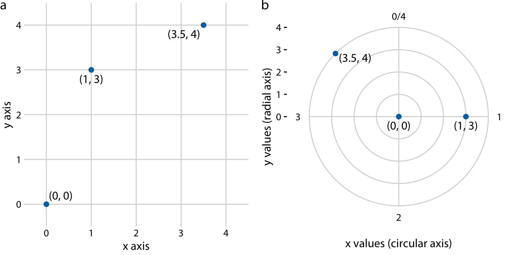
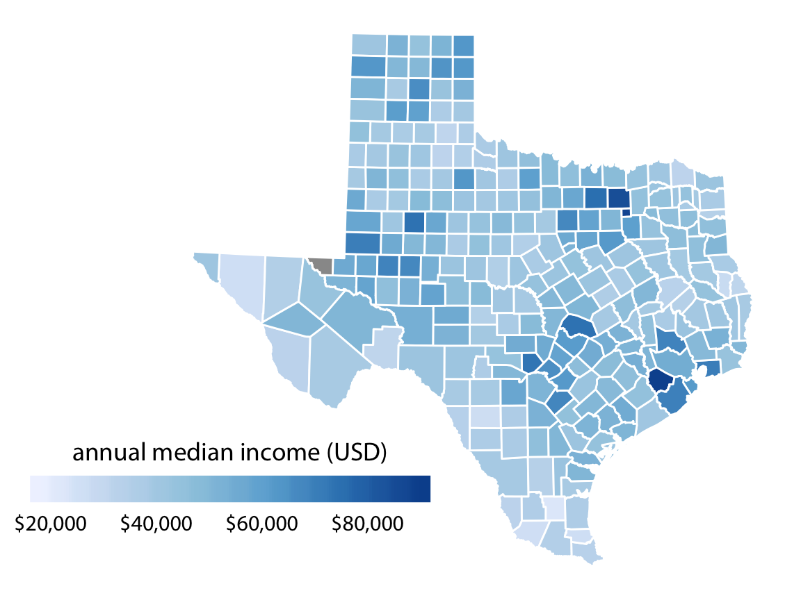

```{r setup, include=FALSE}
library(tidyverse)
library(knitr)
library(kableExtra)
library(dviz.supp)
knitr::opts_chunk$set(echo = TRUE, 
                      message = FALSE, 
                      warning = FALSE, 
                      fig.width = 8, 
                      fig.height = 6, 
                      collapse = TRUE)
```

## Gramática de gráficos

* Descripción precisa de todos los componentes necesarios para realizar una visualización 

  * Wilkinson, L. (2005), *The Grammar of Graphics*

* Una de las implementaciones más conocidas es la librería `ggplot2`:

    * Wickham, H. (2009), [*ggplot2: Elegant Graphics for Data Analysis*](https://ggplot2-book.org/)

* Artículo con las implicaciones de trasladar los conceptos de la gramática de gráficos a un lenguaje de programación (R):

    * Wickham, H. (2010), [*A Layered Grammar of Graphics*](https://vita.had.co.nz/papers/layered-grammar.pdf)


---

## Fundamentos de visualización de datos

* Wilke, C. O., (2019) [Fundamentals of data visualization](https://serialmentor.com/dataviz/)

* Guía moderna para realizar visualizaciones que:

  1. reflejan los datos de forma precisa
  
  2. cuentan una historia
  
  3. tienen una estética profesional
  
* Conceptos independientes de la herramienta que se usa!

* Los ejemplos del libro están hechos con `ggplot2` y otras librerías auxiliares

* Referencia principal de esta sesión (material en [Github](http://albertotb.com/curso-uam-dataviz/))

---

class: inverse, center, middle

# Visualización de datos

---

## Características estéticas

* Toda visualización es una correspondencia entre datos y características estéticas

* Ejemplo: un gráfico de dispersión representa la relación entre dos variables, **x** e **y**, mediante puntos

* Dos tipos:

  1. pueden representar datos continuos
  
  2. **no** pueden representar datos continuos
  
---

## Ejemplos

![:vspace 4]

.center[

]

---

## Tipos de datos

* Independientes del lenguaje de programación/herramienta!

  1. **Numéricos continuos**: números decimales
  
  2. **Numéricos discretos**: por ej. números enteros
  
  3. **Categóricos**: con o sin orden, por ej. las CC.AA de España
  
  4. **Fechas/horas**: pueden ser continuos o discretos dependiendo de lo que representen
  
  5. **Texto**


---

## Ejemplo

¿Qué tipos de datos hay en la siguiente tabla?

```{r echo=FALSE}
df <- read_csv("ultimosdatos_3126Y_datos-horarios.csv", 
               locale = locale(encoding = "ISO-8859-1"), 
               skip = 3)
```

```{r echo=FALSE}
df %>% 
  select(`Fecha y hora oficial`, `Temperatura (ºC)`, `Velocidad del viento (km/h)`, `Dirección del viento`) %>%
  rename(`Viento (km/h)` = `Velocidad del viento (km/h)`,
         `Fecha y hora` = `Fecha y hora oficial`) %>%
  mutate(Estacion = "El Goloso") %>%
  drop_na()%>% 
  head(11) %>%
  arrange(`Fecha y hora`) %>%
  kable()
``` 

.center[
Fuente: [AEMET](http://www.aemet.es/es/eltiempo/observacion/ultimosdatos)
]

---

## Escalas

* Definen la equivalencia entre valores y elementos del gráfico

* Correspondencia 1 a 1 para evitar gráficos ambiguos

![:vspace 3]

.center[

]

---

## Ejemplo gráfico de líneas

.center[

]
---

## Ejemplo *heatmap*

![:vspace 8]

.center[

]

---

## Múltiples escalas

¿Cuántas escalas tiene el siguiente gráfico?

.center[

]

---

class: inverse, center, middle

# Sistemas de coordenadas y ejes

---

## Sistemas de coordenadas

* Necesarios para cualquier tipo de visualización

* Determinan donde se van a posicionar los distintos valores

* Para gráficos estándar en 2D, necesitamos 2 valores para identificar una posición

* Además también necesitamos especificar la distribución relativa

* **Sistema de coordenadas**: combinación de escalas de posición y su distribución relativa

---

## Coordenadas cartesianas

* Sistema de coordenadas más habitual

* Dos ejes ortogonales con escalas continuas, **x** e **y**

* Invariantes frente a transformaciones lineales

.center[

]

---

## Ejemplo

.center[

]

---

## Ejes lineales vs no lineales

* **Eje lineal**: la separación entre dos líneas de la rejilla es la misma en la visualización que en las unidades de los datos

* **Eje no lineal**: la distancia entre dos líneas de la rejilla no es proporcional a la separación en las unidades de los datos

![:vspace 0.5]

.center[

]

---

## Escala logaritmica

* Escala no lineal más común

* Multiplicar en la escala logarítmica es como sumar en la escala lineal

* Conveniente para datos que provienen de multiplicaciones/divisiones, por ej. ratios

```{r echo=FALSE}
df <- data.frame(poblacion = c(50, 100, 200), 
                 media = c(100, 100, 100),
                 ratio = c(0.5, 1, 2))

kable(df)
```

![:vspace 3]

```{r echo=FALSE, fig.width = 6, fig.asp = 1.7/4, fig.align='center'}
xaxis_lin <- ggplot(df, aes(ratio, y = 1)) + 
  geom_point(size = 3, color = "#0072B2") + 
  scale_y_continuous(limits = c(0.9, 1.1), expand = c(0, 0), breaks = 1) +
  theme_dviz_grid(14, rel_large = 1) +
  theme(axis.ticks.length = grid::unit(0, "pt"),
        axis.text.y = element_blank(),
        axis.title.y = element_blank(),
        axis.ticks.y = element_blank(),
        plot.title = element_text(face = "plain"),
        plot.margin = margin(3, 14, 3, 1.5))

plotlist <- 
  align_plots(xaxis_lin + scale_x_continuous(limits = c(0, 2)) + 
                ggtitle("datos originales, escala lineal"),
              xaxis_lin + scale_x_log10(limits = c(0.5, 2), breaks = c(0.5, 1, 2),
                                        labels = c("0.5", "1", "2")) + 
                ggtitle("datos originales, escala logarítmica (base 10)"))
plot_grid(plotlist[[1]], plotlist[[2]], ncol = 1)
```

---

## Otras escalas

* Escala logarítmica es también útil cuando hay datos con magnitudes muy diferentes
  * Representar en una misma escala una ciudad con población 100 y otra con población 1M
  
* Problema: no puede haber 0 en la escala logarítimica (`log(0) = -inf`)

* En algunos casos pueden ser útiles otras transformaciones, por ej. la raíz cuadrada

---

## Ejemplo

![:vspace 7]

.center[

]

---

## Sistemas de coordenadas  curvos

* Las coordenadas polares son el ejemplo más común

* Especificamos una posición usando un ángulo y una distancia radial al origen

* Útiles para datos con periodicidad intrínseca

![:vspace 2]

.center[

]

---

## Ejemplo

.center[

]

---

## Datos geográficos


---

## Otro ejemplo

.center[


Fuente: [ggradar](https://www.ggplot2-exts.org/ggradar.html)
]


---

## Otro (mal) ejemplo

.center[


Fuente: [Radar Plots usando ggplot2](https://rpubs.com/htejero/212368)
]

---

class: inverse, middle, center

# Escalas de color

---

## Escalas de color cualitativas

* En variables categóricas, usamos el color para distinguir grupos que no tienen ningún orden

* Características deseables:

  1. claramente **distinguibles** unos de otros
  
  2. **equivalentes**  
     * ningún color puede destacar sobre el resto
  
  3. distinguibles incluso para personas **daltónicas**

---

## Ejemplos

* Se pueden crear escalas personalizadas en la web [ColorBrewer 2.0](http://colorbrewer2.org/)

* También hay muchas disponibles:
    
  

* A no ser que exista alguna razón de peso (por ej. colores corporativos), siempre es recomendable usar una de las múltiples escalas por defecto

* Muchas fueron creadas para cumplir las propiedades anteriores:
  
  * .footnotesize[Okabe, M., and K. Ito. (2008), [Color Universal Design (CUD): How to Make Figures and Presentations That Are Friendly to Colorblind People.](https://jfly.uni-koeln.de/color/)]


---

## Escalas de color secuenciales

* Con variables continuas, usamos escalas de color secuenciales

* Revelan patrones en nuestros datos que sería muy complicado ver de otra forma

* Simplifican a nuestro cerebro la tarea de procesar...
  
  * ...que valores son más pequeños que otros
  * ...distancia entre valores
  
* Características deseables [[A better default colormap for matplotlib](https://www.youtube.com/watch?v=xAoljeRJ3lU)]:

  1. colorida
  
  2. agradable
  
  3. **secuencial**
  
  4. **perceptualmente uniforme**
  
  5. distinguible en **blanco y negro**
  
  6. accesible para personas **daltónicas**

---

## viridis


.center[Fuente: [mpl colormaps](https://bids.github.io/colormap/)]

---

## Secuenciales vs divergentes

.center[

]

--

![:vspace 0.5]

.center[

]

---

## Ejemplo secuencial

.center[

]

---

## Ejemplo divergente

.center[

]

---

## Destacar elementos usando color

* Las escalas de color qualitativas se pueden modificar para resaltar ciertos grupos:

  * creando versiones más oscuras y/o saturadas de algunos colores
  
  * combinando una escala de grises + color

* Importante que ninguno de los colores no-resaltados destaque sobre el resto!

.center[

]

* Otra opción es eliminar todo el color excepto el de los datos a resaltar

---

## Ejemplo resaltado

.center[

]

---

class: inverse, middle, center

# Tipos de gráficos

---

## Cantidades

---

## Distribuciones

---

## Proporciones

---

## Asociaciones de variables cuantitativas

---

## Series temporales

---

## Tendencias

---

## Datos geoespaciales